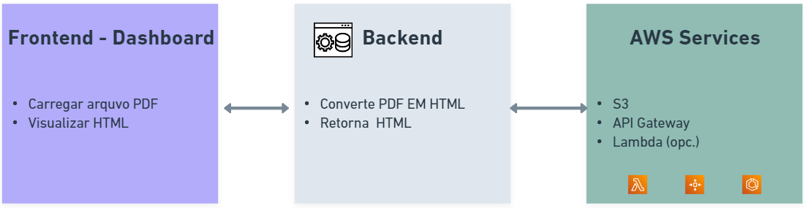

# Documento de Arquitetura de Software (DAS) - Microserviço de Conversão PDF2HTML

## 1. Introdução

### 1.1. Propósito

Este documento visa descrever a arquitetura do sistema de conversão PDF2HTML, detalhando os componentes técnicos, as interações e os padrões adotados para a sua implementação.

### 1.2. Escopo

O sistema abordado realiza a conversão de documentos PDF para HTML. Ele utiliza a ferramenta `pdf2htmlEX`, se integra com serviços da AWS (S3 e API Gateway) e dispõe de um dashboard hospedado no Vercel.

### 1.3. Definições, Acrônimos e Abreviações

- **PDF**: Portable Document Format
- **HTML**: HyperText Markup Language
- **AWS**: Amazon Web Services
- **S3**: AWS Simple Storage Service
- **API**: Application Programming Interface
- **DAS**: Documento de Arquitetura de Software

### 1.4. Referências

- [Link para a documentação oficial do pdf2htmlEX](#)
- [Documentação da AWS para S3](#)
- [Documentação da AWS para API Gateway](#)

### 1.5. Visão Geral

Este documento está estruturado em diferentes seções que detalham a arquitetura proposta, desde uma visão lógica até aspectos de implantação e dados.

## 2. Representação Arquitetural

O sistema seguirá uma abordagem baseada em microserviços, onde o serviço de conversão atua como um serviço independente comunicando-se via API.

## 3. Objetivos e Restrições Arquiteturais

- Utilização exclusiva de ferramentas e infraestruturas gratuitas.
- Conversão precisa e fiel de PDF para HTML.
- Escalabilidade para atender a um volume crescente de conversões.

## 4. Visão de Casos de Uso

### 4.1. Realizações de Casos de Uso

1. **Usuário carrega um PDF**: O usuário acessa o dashboard, seleciona um arquivo PDF e solicita a conversão.
2. **Sistema realiza conversão**: O arquivo é enviado para o microserviço, processado e convertido em HTML.
3. **Usuário recebe e visualiza o HTML**: O arquivo convertido é retornado e pode ser visualizado ou baixado pelo usuário.

> **Observação**: Diagrama de casos de uso será adicionado posteriormente.

## 5. Visão Lógica

### 5.1. Visão Geral

O sistema é composto por três componentes principais: o frontend (dashboard), o microserviço de conversão e os serviços de armazenamento e comunicação da AWS.

### 5.2. Pacotes de Design, Camadas e Subsistemas

- **Frontend (Dashboard)**: Hospedado no Vercel, permite que os usuários carreguem e baixem arquivos.
- **Microserviço de Conversão**: Implementa a lógica de conversão usando `pdf2htmlEX`.
- **Infraestrutura AWS**: Usa S3 para armazenamento temporário e API Gateway para expor o microserviço.

> **Observação**: Um diagrama lógico detalhado será adicionado posteriormente.

## 6. Visão de Processo

### 6.1. Visão Geral da Concorrência e Paralelismo

O sistema deve ser capaz de lidar com múltiplas conversões simultaneamente, garantindo que cada conversão seja processada eficientemente sem afetar outras conversões.

> **Observação**: Um diagrama de processos será adicionado posteriormente.

## 7. Visão de Implementação

### 7.1. Visão Geral

O código será organizado em repositórios separados para o frontend e o backend, facilitando a manutenção e a escalabilidade.

### 7.2. Camadas

- **Camada de Apresentação**: Dashboard para interação do usuário.
- **Camada de Lógica de Negócio**: Microserviço de conversão.
- **Camada de Dados**: Serviços da AWS para armazenamento e gerenciamento de dados.

> **Observação**: Diagrama de camadas será adicion
